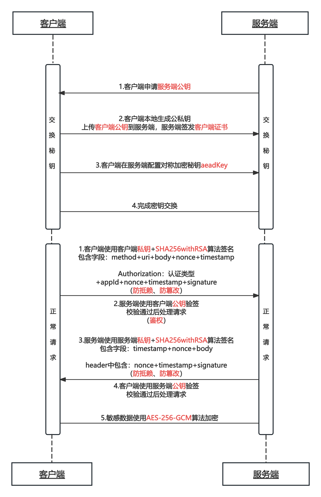

[](https://central.sonatype.com/artifact/io.github.benfromchina/jarvis-http/1.0.3)
[](https://gitee.com/jarvis-lib/jarvis-http/releases/v1.0.3)
[](https://www.apache.org/licenses/LICENSE-2.0.html)
[]()

# Jarvis-HTTP

Jarvis-HTTP 是一个用于简化 HTTP 请求和处理安全通信的 Java 客户端库。它提供了一套完整的工具来支持签名请求、响应验证、数据加密等功能，适用于需要与
HTTP 服务进行安全交互的应用场景。

## 特性

- **安全通信**：支持使用 RSA 和 SM2 算法进行请求签名和响应验证，确保通信的安全性。
- **数据加密**：提供`@AeadEncrypt`和`@PrivacyEncrypt`注解，方便对敏感数据进行对称加密和公钥加密。
- **灵活配置**：通过构建器模式配置客户端，支持自定义连接超时、读取超时等参数。
- **易于集成**：基于 Forest 框架，支持自动化的 HTTP 客户端生成。

## 架构

```
jarvis-http                 // 父模块，统一维护依赖版本、公共配置属性、maven 插件配置等，供其他模块引用和继承
├── jarvis-http-core        // http 协议相关，请求头、请求方法等
├── jarvis-http-sign        // 签名验签模块，提供签名、验签工具类
└── jarvis-http-client      // 客户端模块，基于 forest 发送 http 请求，请求签名、响应验签，注解驱动对称加密、公钥加密
```

## jarvis-http-sign

### 引入依赖

```xml

<dependency>
    <groupId>com.stark.jarvis</groupId>
    <artifactId>jarvis-http-sign</artifactId>
    <version>1.0.4</version>
</dependency>
```

### 环境变量配置

| 变量名                   | 含义                  | 默认值 | 必填 |
|:----------------------|:--------------------|:---:|:--:|
| sign.header.prefix    | 签名请求头前缀，如 "Jarvis-" |     | 否  |
| sign.algorithm.prefix | 签名算法前缀，如 "JARVIS-"  |     | 否  |
| sign.nonce.length     | 签名随机字符串长度           | 32  | 否  |
| sign.expired.minutes  | 签名过期分钟数             |  5  | 否  |

### 流程准备



### 客户端请求签名规则

1. 构造签名串

>
参考 [com.stark.jarvis.http.sign.util.SignUtils#buildClientRequestSignMessage](https://gitee.com/jarvis-lib/jarvis-http/blob/main/jarvis-http-sign/src/main/java/com/stark/jarvis/http/sign/util/SignUtils.java#L134)

签名串一共有五行，每一行为一个参数。结尾以\n（换行符，ASCII编码值为0x0A）结束，包括最后一行。如果参数本身以\n结束，也需要附加一个\n。

```bash
HTTP请求方法\n
URL\n
请求时间戳\n
请求随机串\n
请求报文主体\n
```

2. 计算签名值

>
参考 [com.stark.jarvis.http.sign.util.SignUtils#signClientRequest](https://gitee.com/jarvis-lib/jarvis-http/blob/main/jarvis-http-sign/src/main/java/com/stark/jarvis/http/sign/util/SignUtils.java#L91)

3. 组织签名信息

- 客户端标识 clientId
- 客户端秘钥 clientSecret 用服务端公钥加密
- 商户证书序列号 serialNumber，用于声明所使用的证书
- 请求随机串 nonce，和上面构造签名串的随机串要保持一致
- 时间戳 timestamp，和上面构造签名串的时间戳要保持一致
- 签名值signature，和上面算出来的签名值要保持一致

如：

```bash
clientId="eastsoft",clientSecret="J8R6FRdLBTLEKn1",nonce="a7XQwMoI12kZGDqfbNLByGtVnC24SN4w",timestamp="1697292484",signature="DfV4+wJ8R6FRdLBTLEKn11yyQnK
```

4. 设置请求头

```bash
Authorization: 认证类型 签名信息
```

- 认证类型：`SHA256-RSA2048` 或 `SM2-WITH-SM3` ，可通过环境变量 `sign.algorithm.prefix` 增加前缀，如 `JARVIS-`

如：

```bash
Authorization JARVIS-SHA256-RSA2048 clientId="eastsoft",clientSecret="J8R6FRdLBTLEKn1",nonce="a7XQwMoI12kZGDqfbNLByGtVnC24SN4w",timestamp="1697292484",signature="DfV4+wJ8R6FRdLBTLEKn11yyQnK
```

## jarvis-http-client

### 引入依赖

在你的 `pom.xml` 文件中添加以下依赖：

```xml

<dependency>
    <groupId>com.stark.jarvis</groupId>
    <artifactId>jarvis-http-client</artifactId>
    <version>1.0.4</version>
</dependency>
```

### 环境变量配置

| 变量名                         | 含义                           | 默认值 | 必填 |
|:----------------------------|:-----------------------------|:---:|:--:|
| client.id                   | 客户端ID                        |     | 是  |
| client.secret               | 客户端秘钥                        |     | 是  |
| client.aead_algorithm       | 客户端对称加密算法：AES 或 SM4          |     | 是  |
| client.aead_key             | 客户端对称加密密钥                    |     | 是  |
| client.asymmetric_algorithm | 客户端非对称加密算法：RSA 或 SM2         |     | 是  |
| client.cert.path            | 客户端证书路径，"classpath:" 开头或绝对路径 |     | 是  |
| client.private_key.path     | 客户端私钥路径，"classpath:" 开头或绝对路径 |     | 是  |
| server.public_key.path      | 服务端公钥路径，"classpath:" 开头或绝对路径 |     | 是  |

### 使用示例

1. 使用 forest 注解方式定义接口访问服务端

```java
/**
 * 客户端接口测试
 */
@BaseRequest(baseURL = "http://localhost:8080/das-api/manager/clientApiTest")
public interface ClientApiTestService {

    /**
     * 获取对象
     *
     * @param id 对象ID
     * @return 对象
     */
    @Get(url = "/getForObject/{id}", dataType = "json")
    UserDTO getForObject(@Var("id") Long id);

    /**
     * 上传文件
     *
     * @param bytes    文件内容
     * @param filename 文件名
     */
    @Post("/uploadFile")
    String uploadFile(@DataFile(value = "file", fileName = "${1}") byte[] bytes, String filename, OnProgress onProgress);

    /**
     * 获取对称加密数据
     *
     * @return 对称加密数据
     */
    @Get(url = "/aeadEncrypt", dataType = "json")
    CertificatePayload getAeadEncrypt();

    /**
     * 提交对称加密数据
     *
     * @param payload 对称加密数据
     * @return 对称加密数据 toString
     */
    @Post("/aeadEncrypt")
    String postAeadEncrypt(@JSONBody CertificatePayload payload);

    /**
     * 获取非对称加密数据
     *
     * @return 非对称加密数据
     */
    @Get(url = "/privacyEncrypt", dataType = "json")
    User getPrivacyEncrypt();

    /**
     * 提交非对称加密数据
     *
     * @param user 非对称加密数据
     * @return 非对称加密数据 toString
     */
    @Post("/privacyEncrypt")
    String postPrivacyEncrypt(@JSONBody User user);

}
```

2. 需要加密的字段添加 `@AeadEncrypt` 或 `@PrivacyEncrypt` 注解

```java
/**
 * 测试对称加密实体类
 */
@Data
@NoArgsConstructor
@AllArgsConstructor
@Accessors(chain = true)
public class CertificatePayload {

    private String id;

    private String name;

    /**
     * 需要对称加密的字段，添加 @AeadEncrypt 注解
     */
    @AeadEncrypt(associatedData = "certificate")
    private Certificate certificate;

    @Data
    @NoArgsConstructor
    @AllArgsConstructor
    @Accessors(chain = true)
    public static class Certificate {

        private String id;

        private String name;

        private byte[] bytes;

    }

}
```

```java
/**
 * 测试非对称加密实体类
 */
@Data
@NoArgsConstructor
@AllArgsConstructor
@Accessors(chain = true)
public class User {

    private Long id;

    /**
     * 需要公钥加密的字段，添加 @PrivacyEncrypt 注解
     */
    @PrivacyEncrypt
    private String idCardNumber;

    /**
     * 需要公钥加密的字段，添加 @PrivacyEncrypt 注解
     */
    @PrivacyEncrypt
    private String bankCardNumber;

}
```

3. 调用接口

```java
ClientApiTestService clientApiTestService = ServiceFactory
        .builder()
        .connectTimeout(3000)
        .readTimeout(10000)
        .maxRetryCount(3)
        .maxRetryInterval(1000L)
        .build()
        .client(ClientApiTestService.class);
UserDTO user = clientApiTestService.getForObject(1L);
```
